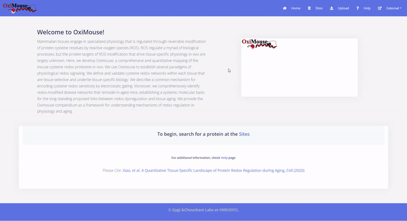
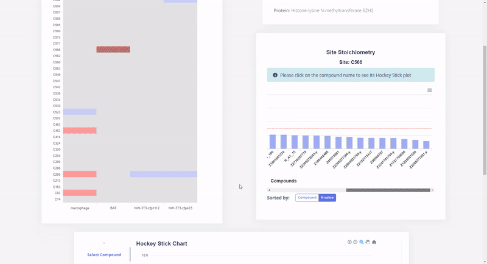

# Cysteine Proteomics Encyclopedia

## Overview

This is an interactive Data Visualization Webapp presenting a research result of Chouchani Lab (Dana-Farber Cancer Institute/Harvard Medical School) via heat map, bar chart, and hockeystick chart using React.js, ApexChart.js and D3.js for frontend, with Python for data preprocessing and backend support.

## The Data

Here, we develop the Cysteine Chemoproteomics Encyclopedia, a comprehensive and quantitative mapping of the cysteine redox proteome using different small molecule compounds in both mouse and human tissues. Using our complex mass spectrometry method, we seek to establish a collective database illustrating how individual small molecule alters the cysteine redox networks in a tissue-specific and organism-specific manner. The mechanistic basis of small molecules on cysteine oxidation can elucidate a better understanding of the general physiology in each cell type and facilitate drug discovery.

## How It Works

- The lab provides a master list requiring processing into CellData files and a compound list
- Retrieved FASTA files from uniprot.org and then parse/convert FASTA files to csv files with added processed data columns
- The app reads data from these csv files and display information to the heatmap, barchart, and hockeystick chart

## Why CSV files instead of a real database and backend system
- This direction was chosen because of time constraint, budget constraint, etc.
- The lab provided new data files (master list) every week. Thus, the data is unexpected and its structure is not stable.
- Error in data was found before and during development. Thus, it needs to be accessed easily by the lab people (non tech people) 
- Feasibilty of the project was in question while stakeholders constantly asking for more leading to scope creep.

## Demo

----------------

## Challenges
- Master list provided by the lab is large (~295mb).
- Master list provided contains useless information because of the software they use to generate this list.
- Data was not as expected by the lab and thus, by the developer.

## Potential improvement
1. Using csv file as database is not secured. A backend system and a database were planned to be implemented when the lab could provide a stable dataset with no error.
2. Authentication for different roles. It was envisioned that there would be contributors and approvers to the project's database.
3. There is glitch in the bar chart when scrolling

## Issues
Because of unexpected data error seen through the app visualization, Zoey reported to the lab manager. It was discovered that the produced data did not match the assumption of the research. The project came to a halt to redo all lab work.
